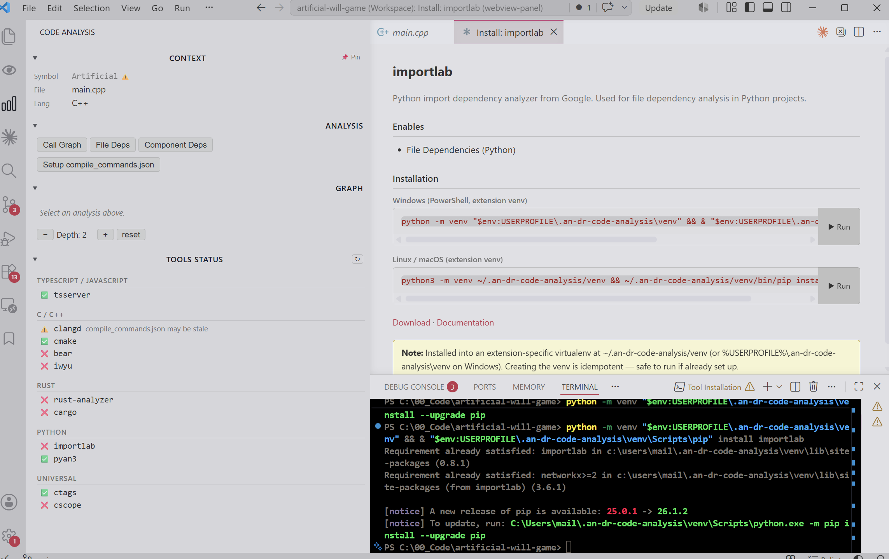

# an-dr-code-analysis — Implementation Plan

Each iteration ends with a reviewable checkpoint. Complete one before starting the next.

---

## Iteration 1 — Scaffolding

Get a buildable, activatable extension with an empty sidepanel.

- [x] Create `package.json` (publisher `an-dr`, engine `^1.90.0`, `activationEvents: ["*"]`)
  - Register `viewsContainers.activitybar` and `views.an-dr-code-analysis` (webview type)
- [x] Create `tsconfig.json` and `webpack.config.js` (two entry points: extension + webview)
- [x] Create `src/extension.ts` — activate(), register sidepanel provider, return empty exports
- [x] Create `src/SidepanelProvider.ts` — `WebviewViewProvider` with static HTML placeholder
- [x] Create `webview-src/index.ts` — empty entry point, renders "Code Analysis (loading...)"
- [x] Build succeeds (`npm run build`), extension loads in Extension Development Host
- [x] Sidepanel appears in Activity Bar with placeholder text

**Verification:**

1. Run `npm run install-ext` in `extensions/an-dr-code-analysis`
2. Reload VS Code window (`Developer: Reload Window`)
3. Click the graph icon in the Activity Bar → "Code Analysis" panel opens
4. Panel shows "Code Analysis — ready" placeholder text
5. No errors in the Extension Host output channel

- [x] **Approved**

---

## Iteration 2 — Tool Detection (TOOLS STATUS section)

Detect installed tools on activation and render status in the panel.

- [x] Create `src/tools/ToolRegistry.ts` — detects: clangd, rust-analyzer, cargo, ctags, cscope, pyan3, cmake, bear, importlab, iwyu; tsserver always "ok" (bundled)
- [x] Create `src/tools/ClangdHealth.ts` — checks `compile_commands.json` presence and staleness
- [x] Define `ToolStatus` type in `src/webview/messages.ts`
- [x] `SidepanelProvider` sends `toolsStatus` message after detection
- [x] Webview renders TOOLS STATUS section with ✅ / ⚠️ / ❌ icons (collapsed by default)
- [x] `ToolRegistry.refresh()` callable on demand

**Verification:**

1. Run `npm run install-ext` in `extensions/an-dr-code-analysis`
2. Reload VS Code window (`Developer: Reload Window`)
3. Open the Code Analysis panel and expand TOOLS STATUS
4. Each tool installed on this machine shows ✅; uninstalled tools show ❌
5. Run `where clangd` (Windows) or `which clangd` (Unix) in terminal — result matches the panel

- [x] **Approved**

---

## Iteration 3 — Context Tracking (CONTEXT section)

Track active editor symbol and file; render in panel.

- [x] Create `src/context/ContextTracker.ts`
  - Subscribe to `onDidChangeActiveTextEditor` and `onDidChangeTextEditorSelection` (debounced 300ms)
  - Symbol detection: **word-boundary regex only** (`getWordRangeAtPosition`) — picks up any word under the cursor, not a semantic symbol
  - `pin()` / `unpin()` / `toggle()` / `isPinned()`
  - Emit `onContextChange: vscode.Event<EditorContext>`
- [x] Define `contextUpdate` and `togglePin` messages in `messages.ts`
- [x] `SidepanelProvider` posts `contextUpdate` on every context change
- [x] Webview renders CONTEXT section: Symbol, File, Lang, Pin button
- [x] Pin toggle works (pinned state visually distinct)

> ⚠️ **Known limitation:** Symbol shown is the word under the cursor, not a semantic symbol. It can be a parameter name, a keyword, or a comment word — anything. This means the CONTEXT display is unreliable as a preview of what will actually be analyzed. See Iteration 3b below for the fix.

**Verification:**

1. Run `npm run install-ext` and reload VS Code (`Developer: Reload Window`)
2. Open a `.cpp` file — CONTEXT section shows the file name and `C++`
3. Click on a function name — Symbol field updates to that word
4. Switch to a different editor tab — CONTEXT updates to new file
5. Click Pin (📌) — switch tabs — CONTEXT stays locked to the pinned symbol
6. Click Pin again — CONTEXT unfreezes and updates normally

- [x] **Approved**

---

## Iteration 3b — Semantic Symbol Detection

Replace word-boundary symbol detection with `vscode.prepareCallHierarchy`, which returns the exact `CallHierarchyItem` the analyzer will use in Iteration 6. This ensures the CONTEXT display is honest: it shows a symbol only when the LSP can actually analyze it.

- [x] Three-tier symbol detection in `ContextTracker._update()`:
  1. `vscode.prepareCallHierarchy` — exact semantic symbol, reused by analyzer (needs clangd + compile_commands)
  2. `vscode.executeDocumentSymbolProvider` → find deepest enclosing symbol — works for header files without compile_commands
  3. `getWordRangeAtPosition` — last resort, always available
- [x] Stale-update guard: async results from a previous cursor position are discarded
- [x] `CallHierarchyItem` stored on `ContextTracker` for Iteration 6 (no second LSP round-trip)
- [x] `symbolSource: 'call-hierarchy' | 'document-symbol' | 'word'` on `EditorContext`
- [x] Webview renders symbol bold (call-hierarchy), normal (document-symbol), or dimmed with tooltip (word)

**Verification:**

1. Run `npm run install-ext` and reload VS Code (`Developer: Reload Window`)
2. Click inside a function body (not on its name) — Symbol shows the enclosing function name
3. Click on a parameter name — Symbol shows `—` (not the parameter word)
4. Click on a comment word — Symbol shows `—`
5. Click on a function call site — Symbol shows the called function's name

- [x] **Approved**

---

## Iteration 4 — Graph Infrastructure

Define types and wire the analysis skeleton without any real analyzer yet.

- [x] Create `src/graph/GraphModel.ts` — all types from spec §7.5
- [x] Create `src/analyzers/IAnalyzer.ts` — `IAnalyzer`, `AnalysisRequest`, `AnalysisResult` interfaces
- [x] Create `src/analyzers/AnalyzerFactory.ts` — stub returning empty chain
- [x] Create `src/cache/AnalysisCache.ts` — mtime-based cache with `FileSystemWatcher`
- [x] Create `src/config/Settings.ts` — typed accessors for all settings (§08)
- [x] Create analysis pipeline in `SidepanelProvider`: receives `requestAnalysis`, runs chain, sends `analysisResult` or `analysisError`
- [x] Webview renders ANALYSIS section: three buttons (Call Graph, File Deps, Component Deps)
- [x] Webview renders GRAPH section skeleton: graph area placeholder, depth controls (no renderer yet), confidence badge area
- [x] Define all message types in `messages.ts`

**Verification:**

1. Run `npm run install-ext` and reload VS Code (`Developer: Reload Window`)
2. Open the panel — three analysis buttons are visible (Call Graph, File Deps, Component Deps)
3. Click "Call Graph" — button shows spinner / "Analyzing..." state
4. After a moment — "No results found" message appears (no crash)
5. Depth `[−]` / `[+]` / `[reset]` controls are visible below the graph area
6. No errors in Extension Host output

- [x] **Approved**

---

## Iteration 5 — Cytoscape Renderer

Render graphs in the webview. Use stub data first to verify rendering.

- [x] Add `cytoscape` as a bundled dependency (no CDN)
- [x] Create `webview-src/graph/CytoscapeRenderer.ts` — renders `GraphModel` into a `cy` instance
- [x] Create `webview-src/graph/layouts.ts` — radial (call graph sidebar), hierarchical (expanded), force-directed (file/component deps)
- [x] Node styling: target (large, bold), caller, callee, external (gray)
- [x] Edge styling: directed arrows, dashed for external
- [x] Node interactions: single click → `nodeClick` message, double-click → `nodeDoubleClick` message, hover tooltip (full name + file)
- [x] Depth `[−]` / `[+]` / `[reset]` controls wired to `depthChange` message (debounced 500ms)

**Verification:**

1. Run `npm run install-ext` and reload VS Code (`Developer: Reload Window`)
2. Open the panel — a hardcoded stub graph (3–5 nodes, 2–3 edges) renders automatically
3. Nodes are visually distinct: target node is larger/bolder, caller/callee use different colors
4. Edges have directed arrows; at least one dashed edge (external)
5. Hover a node — tooltip shows full name and file path
6. Click `[+]` depth — graph re-renders with more nodes
7. Click `[reset]` — returns to default depth

- [x] **Approved**

---

## Iteration 6 — clangd Call Graph (first real analysis)

Implement LSP call hierarchy for C/C++ via clangd.

- [x] Create `src/analyzers/lsp/LspClient.ts` — LSP protocol helpers (callHierarchy/prepareCallHierarchy, incomingCalls, outgoingCalls)
- [x] Create `src/analyzers/lsp/LspAnalyzer.ts` — implements `IAnalyzer` for C/C++, call graph only
- [x] Create `src/graph/GraphBuilder.ts` — normalizes LSP call hierarchy response → `GraphModel`
- [x] Wire `LspAnalyzer` into `AnalyzerFactory` for `c`/`cpp` + `callGraph`
- [x] Confidence: `high`, tool: `clangd`

**Verification:**

1. Run `npm run install-ext` and reload VS Code (`Developer: Reload Window`)
2. Open a `.cpp` file that has a project with `compile_commands.json`
3. Click on a function name — CONTEXT shows the symbol
4. Click "Call Graph" — real graph renders with callers and callees
5. Confidence badge shows 🟢 `clangd`
6. Double-click a node — editor jumps to that function's definition

- [x] **Approved**

---

## Iteration 7 — ctags Fallback

Add universal fallback for call graph when LSP unavailable or empty.

- [x] Create `src/analyzers/cli/CtagsAnalyzer.ts` — runs `ctags -R --fields=+n --output-format=json`, greps call sites → `GraphModel`; confidence `medium`
- [x] `AnalyzerFactory.getChain()` returns `[LspAnalyzer, CtagsAnalyzer]` for C/C++ call graph
- [x] Fallback chain logic in pipeline: try each analyzer in order, use first non-empty result
- [x] Confidence badge reflects actual tool used
- [x] Show warning in graph if fallback was used

**Verification:**

1. Run `npm run install-ext` and reload VS Code (`Developer: Reload Window`)
2. Open a `.cpp` file **without** `compile_commands.json` (or rename it away temporarily)
3. Click "Call Graph" — graph renders using ctags
4. Confidence badge shows 🟡 `ctags`
5. A warning note is visible indicating fallback was used
6. Restore `compile_commands.json` — re-run — badge returns to 🟢 `clangd`

- [ ] **Approved**

---

## Iteration 8 — File Dependencies (C/C++)

Implement file dependency graph via clangd `documentLink` + `#include` regex fallback.

- [x] Extend `LspAnalyzer` to handle `fileDeps` graph type via `textDocument/documentLink`
- [x] Create `src/analyzers/heuristic/RegexAnalyzer.ts` — `#include` parse → `GraphModel`; confidence `low`
- [x] Wire both into factory for `c`/`cpp` + `fileDeps`
- [x] "File Deps" button now triggers real analysis

**Verification:**

1. Run `npm run install-ext` and reload VS Code (`Developer: Reload Window`)
2. Open a `.cpp` file that includes several headers
3. Click "File Deps" — graph renders with the active file at center and included files as nodes
4. Confidence badge shows 🟢 `clangd` (or 🔴 regex if clangd unavailable)
5. With clangd disabled: repeat — badge shows 🔴 `regex`, graph still renders from `#include` lines

- [x] **Approved**

---

## Iteration 9 — clangd Health ~~& Recovery Actions~~ ~~CANCELLED: recovery buttons~~

Surface clangd misconfiguration in Tools Status and gate the analyzer on it.

- [x] `ClangdHealth.ts`: `compile_commands.json` detection via extension setting, `.clangd` `CompilationDatabase:` directive, or workspace root fallback
- [x] `ClangdHealth.check()` delegates to `checkDetail()` — single source of truth for both Tools Status and analyzer gating
- [x] `LspAnalyzer.canHandle()` returns false when issue is `NO_COMPILE_COMMANDS` — no silent bad results
- [x] Cross-compilation detection in `RecoveryActions.ts` (`detectCrossCompile`) — used by health check
- [x] Health warning shown in analysis section only when ctags is also unavailable (otherwise Tools Status is sufficient)
- [x] ~~Recovery action buttons (cmake generate, bear wrap, .clangd generate)~~ — cancelled, out of scope

- [x] **Approved**

---

## Iteration 10 — Debug & Cleanup

Stabilise the existing feature set before adding new languages. No new functionality.

- [ ] Run the adversarial UT agent (see `AGENTS.md`) — capture all bugs as passing regression tests in `TECHDEBT.md`
- [ ] Fix every bug surfaced by the UT run
- [ ] Remove dead code (constants, settings, and functions whose output is never consumed)
- [ ] Review all log lines — remove noise, keep signal
- [ ] Verify the full flow on a real project: clangd path, ctags fallback, file deps, filter tree, pin, depth
- [ ] All TypeScript strict-mode warnings resolved

**Verification:**

1. `npm run compile` — zero errors and zero warnings
2. UT suite passes with no skipped tests
3. TECHDEBT.md exists; every listed bug has a corresponding fix commit or a tracked issue

- [x] **Approved**

---

## Iteration 12 — TypeScript / JavaScript (tsserver)

Add TS/JS support.

- [ ] Extend `LspAnalyzer` for `typescript`/`javascript` via tsserver
- [ ] Add TS compiler API fallback for file deps (`ts.createProgram`)
- [ ] `tsconfig.json` `references` → component deps
- [ ] Wire into factory for all three graph types

**Verification:**

1. Run `npm run install-ext` and reload VS Code (`Developer: Reload Window`)
2. Open a `.ts` file
3. Click "Call Graph" → graph renders, badge shows 🟢 `tsserver`
4. Click "File Deps" → import graph renders
5. Open a project with `tsconfig.json` `references` → "Component Deps" shows project references graph
6. Open a `.js` file → same three analyses work (lower accuracy expected)

- [ ] **Approved**

---

## Iteration 13 — Rust (rust-analyzer + cargo)

Add Rust language support.

- [ ] Extend `LspAnalyzer` to handle `rust` language via rust-analyzer
- [ ] Create `src/analyzers/cli/CargoAnalyzer.ts` — `cargo metadata --format-version 1` → component deps `GraphModel`
- [ ] Wire into factory: `rust` + `callGraph` → `[LspAnalyzer, CtagsAnalyzer]`; `rust` + `fileDeps` → `[LspAnalyzer, RegexAnalyzer]`; `rust` + `componentDeps` → `[CargoAnalyzer]`

**Verification:**

1. Run `npm run install-ext` and reload VS Code (`Developer: Reload Window`)
2. Open a `.rs` file in a Cargo workspace
3. Click "Call Graph" → graph renders, badge shows 🟢 `rust-analyzer`
4. Click "File Deps" → module dependency graph renders
5. Click "Component Deps" → crate/workspace graph renders using `cargo metadata`

- [ ] **Approved**

---

## Iteration 14 — Python (pyan3 + AST)

Add Python support.

- [ ] Create `src/analyzers/cli/Pyan3Analyzer.ts` — runs `pyan3 --dot`, parses DOT → `GraphModel`; confidence `medium`
- [ ] Create `src/analyzers/heuristic/AstWalkAnalyzer.ts` — `import` AST walk → file deps; confidence `low`
- [ ] Wire into factory: `python` + `callGraph` → `[Pyan3Analyzer, CtagsAnalyzer]`; `python` + `fileDeps` → `[AstWalkAnalyzer]`

**Verification:**

1. Run `npm run install-ext` and reload VS Code (`Developer: Reload Window`)
2. Open a `.py` file
3. Click "Call Graph" → graph renders, badge shows 🟡 `pyan3`
4. Click "File Deps" → import graph renders, badge shows 🔴 `ast-walk`
5. With pyan3 uninstalled: Call Graph falls back to ctags, badge shows 🟡 `ctags`

- [ ] **Approved**

---

## Iteration 15 — Component Dependencies (CMake + directory heuristic)

Add component-level analysis for C/C++.

- [ ] Create `src/analyzers/cli/CmakeAnalyzer.ts` — `cmake --graphviz=<tmpfile>`, parses DOT → `GraphModel`
- [ ] Directory heuristic fallback: group files by top-level directory, infer deps from `#include` across groups
- [ ] Wire into factory: `c`/`cpp` + `componentDeps` → `[CmakeAnalyzer, RegexAnalyzer(heuristic)]`

**Verification:**

1. Run `npm run install-ext` and reload VS Code (`Developer: Reload Window`)
2. Open a CMake project with multiple targets
3. Click "Component Deps" → CMake target dependency graph renders, badge shows 🟡 `cmake`
4. Remove `CMakeLists.txt` access (or open a non-CMake project) → heuristic fallback renders directory-level graph

- [ ] **Approved**

---

## Iteration 16 — Expand to Full Tab

Wider graph in a `WebviewPanel` editor tab.

- [ ] Clicking ↗ in GRAPH section opens `vscode.window.createWebviewPanel`
- [ ] Title: `Code Analysis — {graphType} — {symbol or file}`
- [ ] Same `CytoscapeRenderer` instance, hierarchical layout, higher depth default (max 8)
- [ ] Independent from sidebar (both work simultaneously)
- [ ] No PNG/SVG export yet (deferred)

**Verification:**

1. Run `npm run install-ext` and reload VS Code (`Developer: Reload Window`)
2. Run any analysis in the sidebar to get a graph result
3. Click ↗ → new editor tab opens titled "Code Analysis — Call Graph — {symbol}"
4. Graph renders at wider width with hierarchical layout
5. Interact with sidebar (pin, depth change) → sidebar still works independently
6. Depth control in expanded tab goes up to 8

- [ ] **Approved**

---

## Iteration 17 — Polish

Final UX pass.

- [ ] Cancellation: if analysis runs >10s, show "Cancel" button; wire to `AbortController`
- [ ] Context-switch notice: if file changes mid-analysis, show "Results are for {previous file}"
- [ ] Node right-click context menu: "Jump to Definition", "Copy Name", "Pin this symbol"
- [ ] TOOLS STATUS: clicking ⚠️/❌ item shows popover (install hint + affected capabilities)
- [ ] Empty result display: "No results found" with tool name (not an error)
- [ ] Output channel logging for all analysis steps (errors, fallbacks, tool output)
- [ ] Section collapse/expand state persisted across panel closes

**Verification:**

1. Run `npm run install-ext` and reload VS Code (`Developer: Reload Window`)
2. Trigger a slow analysis, wait 10s → "Cancel" button appears; clicking it stops the analysis
3. Start an analysis, then switch files → "Results are for {old file}" notice appears
4. Right-click a graph node → context menu shows Jump to Definition / Copy Name / Pin
5. Click a ⚠️ tool in TOOLS STATUS → tab opens with install instructions
6. Run analysis on a file with no callable symbols → "No results found (clangd)" — not an error state
7. Collapse a section, close the panel, reopen → section stays collapsed

- [ ] **Approved**
