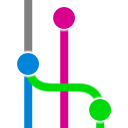

  
  <samp>
    <h1>an-dr: Commits (MIT) for Visual Studio Code</h1>
    <h3>An MIT-licensed Git graph with visual history, branch actions, and repository controls.</h3>
  </samp>

## Provenance

This extension derives exclusively from the MIT-licensed
[neo-git-graph](https://github.com/asispts/neo-git-graph) codebase. The exact
upstream revision and copyright notices are recorded in [NOTICE.md](NOTICE.md).
It is an independent an-dr extension and is not affiliated with the original
Git Graph project.

## Features

- **Graph view**: See branches, tags, and uncommitted changes in one graph
- **Commit details**: Click a commit to see message, files, and diffs
- **Branch actions**: Create, checkout, rename, delete, and merge
- **Tag actions**: Create, delete, and push tags
- **Commit actions**: Checkout, cherry-pick, revert, and reset
- **Avatar support**: Optional avatars from GitHub, GitLab, or Gravatar
- **Multi-repo**: Work with multiple repositories in one workspace
- **Devcontainer ready**: Works in remote and container environments

## Configuration

All settings use the `an-dr-com-mit-s` prefix.

| Setting                       | Default         | Description                                      |
| ----------------------------- | --------------- | ------------------------------------------------ |
| `autoCenterCommitDetailsView` | `true`          | Center commit details when opened                |
| `dateFormat`                  | `"Date & Time"` | `"Date & Time"`, `"Date Only"`, or `"Relative"`  |
| `dateType`                    | `"Author Date"` | `"Author Date"` or `"Commit Date"`               |
| `fetchAvatars`                | `false`         | Fetch avatars (sends email to external services) |
| `graphColours`                | 12 defaults     | Colors for graph lines                           |
| `graphStyle`                  | `"rounded"`     | `"rounded"` or `"angular"`                       |
| `initialLoadCommits`          | `300`           | Commits to load on open                          |
| `loadMoreCommits`             | `100`           | Commits to load on demand                        |
| `maxDepthOfRepoSearch`        | `0`             | Folder depth for repo search                     |
| `showCurrentBranchByDefault`  | `false`         | Show only current branch on open                 |
| `showStatusBarItem`           | `true`          | Show status bar button                           |
| `statusBarIconOnly`            | `true`          | Show only the status bar icon                    |
| `showUncommittedChanges`      | `true`          | Show uncommitted changes node                    |
| `tabIconColourTheme`          | `"colour"`      | `"colour"` or `"grey"`                           |

## Installation

Run `./install.ps1` from the repository root, then use **an-dr: Commits (MIT):
View Git Graph** from the Command Palette.

## License

MIT — see [LICENSE](LICENSE).

See [NOTICE.md](NOTICE.md) for the source baseline and attribution.
